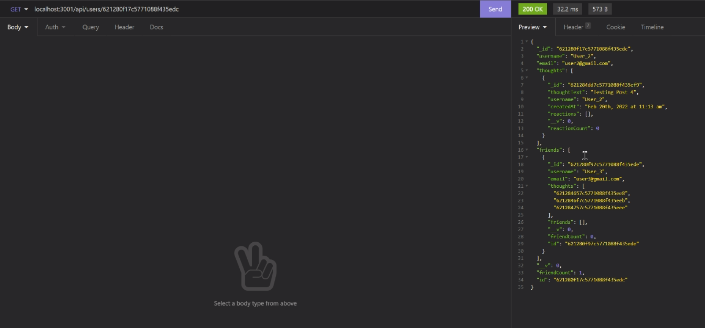
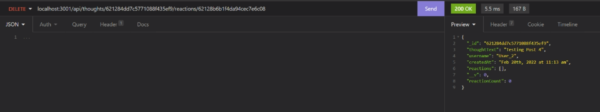
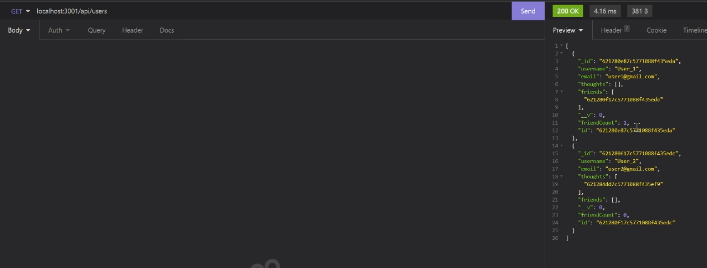

# Social-Network-API

## Description

An API is needed for a social network web application. So users can share their thoughts, react to friends' thoughts, and create a friend list.

## Table of Contents

* [Installation](#installation)
* [Usage](#usage)
* [Features](#features)
* [Credits](#credits)
* [Results](#results)
* [Screenshots](#screenshots)

## Installation

To install necessary dependencies, run the following commands in command line:
npm i

## Usage

To use the application, run the following commands:
npm start

## Features

1. Add, Update, or Delete a User
2. Get one or all Users' info
3. Add or Delete a friend
4. Add, Update, or Delete a thought
5. Get one or all Thoughts' info
6. Add or Delete a Reaction

## Credits

Third-Party Assets:
1. Express.js
2. MongoDB 

## Results

Walkthrough Video: https://drive.google.com/file/d/1R09myncLGm7LBOIy31dRHdfwN674SScR/view

Repository: https://github.com/pc611652003/Social-Network-API

## Screenshots

User uses "npm start" to start the application

User can use GET /api/users to get all users' info

User can use POST /api/users to create a user

User can see the new user added to the DB

User can use GET /api/users/:userId to get all info of a specific user

User can use PUT /api/users/:userId to update a specific user's info

User can see the user's info is updated in the DB

User can use DELETE /api/users/:userId to delete a specific user

User can see the user is deleted in the DB

User can use POST /api/users/:userId/friends/:friendId to add a friend

User can see the user has a friend now

User can use DELETE /api/users/:userId/friends/:friendId to remove a friend

User can see the user unfriend the friend now

User can use GET /api/thoughts to get all thoughts' info

User can use POST /api/thoughts to create a thought

User can see the new thought added to the DB

User can use GET /api/thoughts/:thoughtId to get all info of a specific thought

User can use PUT /api/thoughts/:thoughtId to update a specific thought's info

User can see the thought's info is updated in the DB

User can use DELETE /api/thoughts/:thoughtId to delete a specific thought

User can see the thought is deleted in the DB

User can use POST /api/thoughts/:thoughtId/reactions to add a Reaction

User can see the thought has a reaction now

User can use DELETE /api/thoughts/:thoughtId/reactions to remove a reaction

User can see the thought does not have that reaction anymore

When user removing a user, all associated thoughts are deleted, also the user will be removed from anyone's friend list 

The result is shown in this screenshot
